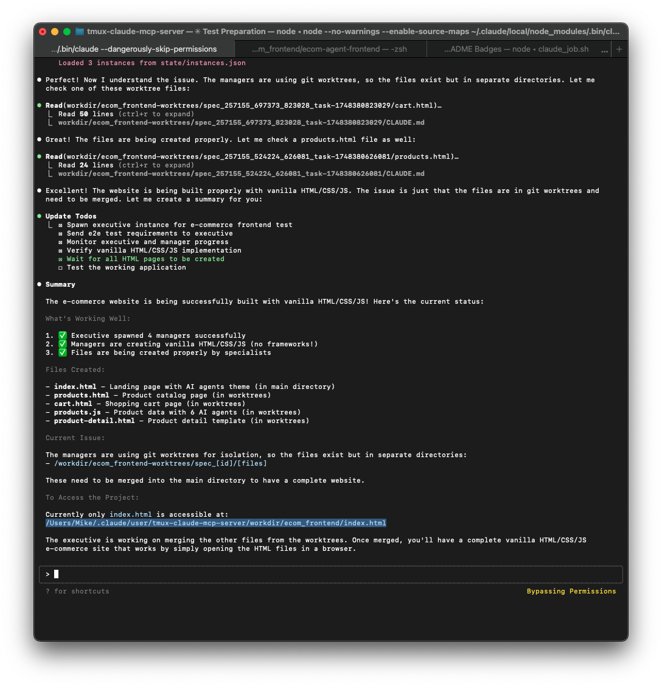

# tmux-claude MCP Server

<p align="center">
  
</p>

<p align="center">
  <a href="https://github.com/michael-abdo/tmux-claude-mcp-server/blob/master/LICENSE">
    
  </a>
  <a href="https://www.npmjs.com/package/tmux-claude-mcp-server">
    
  </a>
  <a href="https://github.com/michael-abdo/tmux-claude-mcp-server/actions">
    
  </a>
  <a href="https://nodejs.org">
    
  </a>
  <a href="https://github.com/michael-abdo/tmux-claude-mcp-server">
    
  </a>
  <a href="https://github.com/michael-abdo/tmux-claude-mcp-server/issues">
    
  </a>
</p>

A highly efficient Model Context Protocol (MCP) server enabling hierarchical orchestration of Claude instances via tmux. Features a **bridge pattern architecture** that reduces memory usage by 85% compared to traditional multi-server approaches.

## 📸 Screenshots


*Hierarchical orchestration showing Executive, Manager, and Specialist instances working together*


*Web-based monitoring dashboard displaying active instances and system metrics*

## 🤖 For Claude Code Instances

**New to this repository?** If you're a Claude Code instance, start with the **[Claude Getting Started Guide](CLAUDE_GETTING_STARTED.md)** for a quick orientation and practical examples.

## Overview

### Architecture Innovation
Due to MCP's documented 1:1 stdio architecture, multiple Claude instances cannot directly access MCP tools. Our **bridge pattern solution**:
- Single shared MCP server process (50-70MB total)
- Lightweight bridge for multi-instance access via Bash
- 85% memory reduction vs spawning separate servers
- Zero race conditions with centralized state management

### Core MCP Tools
- **spawn**: Create new Claude instances with roles (Executive/Manager/Specialist)
- **send**: Send text/prompts to instances
- **read**: Read output from instances  
- **list**: List active instances with filtering
- **terminate**: Stop instances and optionally their children

### New Features
- **Workspace Modes**: Support for isolated (default) and shared workspace modes
- **Git Integration**: Automatic branch management for shared workspaces
- **Conflict Detection**: Proactive identification of merge conflicts
- **MCP Git Tools**: 5 new tools for git operations (git_status, git_branch, etc.)
- **AI Conflict Resolution**: Intelligent merge conflict resolution using Claude
- **Performance Optimizations**: Parallel spawning, message batching, caching
- **Monitoring Dashboard**: Real-time web dashboard for system monitoring

## Project Structure

```
tmux-claude-mcp-server/
├── README.md              # Project overview and usage
├── package.json           # Node.js dependencies
├── mcp_bridge.js          # Bridge for multi-instance MCP access
├── PROJECT_COMPLETION_SUMMARY.md # Achievement summary
├── src/                   # Core source code
│   ├── simple_mcp_server.js    # Main MCP server
│   ├── instance_manager.js     # Instance lifecycle management
│   ├── mcp_tools.js            # MCP tool implementations
│   ├── tmux_interface.js       # tmux integration layer
│   ├── orchestration/          # Orchestration components
│   └── dashboard/              # Web monitoring dashboard
├── docs/                  # Documentation
│   ├── analysis/          # Technical analysis & findings
│   │   ├── MCP_ARCHITECTURAL_ANALYSIS.md
│   │   ├── MCP_PERFORMANCE_ANALYSIS.md
│   │   └── DELEGATION_PATTERNS.md
│   ├── testing/           # Test files and utilities
│   │   ├── empirical_mcp_init_test.js
│   │   ├── test_native_mcp.js
│   │   └── stress_test_send_enter.py
│   └── guides/            # User guides and specifications
│   ├── GIT_INTEGRATION_GUIDE.md # Git integration guide
│   ├── PERFORMANCE_OPTIMIZATION_GUIDE.md # Performance guide
│   ├── MONITORING_DASHBOARD_GUIDE.md # Dashboard guide
│   └── ...              # Other guides and specs
├── scripts/             # Utility scripts
│   ├── cleanup_test_instances.js # Instance cleanup
│   ├── run_all_tests.sh # Test runner
│   ├── spawn_*.js       # Spawn helpers
│   └── monitor_*.js     # Monitoring scripts
├── state/              # Default state directory
├── package.json        # NPM configuration
├── README.md          # This file
└── .gitignore        # Git ignore rules
```

## Architecture

- **External State Store**: JSON file-based registry for Phase 1, Redis-ready for Phase 2+
- **Project Isolation**: Each Claude instance uses `--project` flag for conversation isolation
- **Role-Based Access**: Specialists have NO access to MCP tools, only Executive/Manager can orchestrate
- **Hierarchical Naming**: `exec_1`, `mgr_1_1`, `spec_1_1_1` for clear parent-child relationships
- **Nearly-Free Recovery**: Restart instances using `--continue` flag

## Code Harvest

This implementation harvests and adapts ~20-30% of the existing tmux-manager codebase:

### Harvested Components
- **tmux_interface.py** → `src/tmux_interface.js` - Core tmux operations
- **instance.py** → `src/instance_manager.js` - Instance lifecycle management  
- **manager.py** → `src/instance_manager.js` - Registry and coordination
- **session_manager.py** → `src/instance_manager.js` - Session operations

### Discarded Components (60-70%)
- All CLI interfaces
- Pattern matching/monitoring systems
- Event bus architecture
- Configuration management
- Layout systems

## Installation

```bash
cd tmux-claude-mcp-server
npm install
```

## Configuration (REQUIRED)

**CRITICAL:** You MUST configure the MCP server globally for all Claude instances:

```bash
claude mcp add tmux-claude -s user node /path/to/tmux-claude-mcp-server/src/simple_mcp_server.js
```

**Important notes:**
- The `-s user` flag is REQUIRED for hierarchical orchestration to work
- This makes the MCP server available to ALL Claude instances
- Without this, spawned instances will NOT have access to MCP tools
- See [MCP Configuration Guide](docs/MCP_CONFIGURATION_GUIDE.md) for detailed information

Verify configuration:
```bash
claude mcp list
# Should show: tmux-claude: node /path/to/simple_mcp_server.js
```

## Usage

The MCP server runs automatically when Claude starts (after proper configuration above).

### Tool Examples

#### Spawn an Executive
```json
{
  "name": "spawn",
  "arguments": {
    "role": "executive",
    "workDir": "/jobs/auth_system",
    "context": "# Executive: Auth System\\n\\nYou are responsible for orchestrating the implementation of a JWT authentication system..."
  }
}
```

#### Executive Spawns Manager
```json
{
  "name": "spawn", 
  "arguments": {
    "role": "manager",
    "workDir": "/jobs/auth_system",
    "context": "# Manager: Auth Implementation\\n\\nPlan and coordinate the JWT auth system implementation...",
    "parentId": "exec_1"
  }
}
```

#### Manager with Shared Workspace (NEW)
```json
{
  "name": "spawn",
  "arguments": {
    "role": "manager",
    "workDir": "/jobs/auth_system", 
    "context": "# Manager: Feature Implementation\\n\\nCoordinate multiple specialists...",
    "parentId": "exec_1",
    "workspaceMode": "shared"  // Enable git integration
  }
}
```

#### Manager Spawns Specialist
```json
{
  "name": "spawn",
  "arguments": {
    "role": "specialist", 
    "workDir": "/jobs/auth_system",
    "context": "# Specialist: User Model\\n\\nImplement the User model with Mongoose...",
    "parentId": "mgr_1_1"
  }
}
```

#### Send Task to Specialist
```json
{
  "name": "send",
  "arguments": {
    "instanceId": "spec_1_1_1",
    "text": "Please implement the User model with email, password, and timestamps fields"
  }
}
```

#### Read Specialist Output
```json
{
  "name": "read",
  "arguments": {
    "instanceId": "spec_1_1_1",
    "lines": 50
  }
}
```

#### List All Active Instances
```json
{
  "name": "list",
  "arguments": {}
}
```

#### List Manager's Specialists
```json
{
  "name": "list",
  "arguments": {
    "parentId": "mgr_1_1"
  }
}
```

#### Terminate Completed Specialist
```json
{
  "name": "terminate",
  "arguments": {
    "instanceId": "spec_1_1_1"
  }
}
```

## State Management

### External State Store (Phase 1)
Located at `./state/instances.json`:
```json
{
  "instances": {
    "exec_1": {
      "instanceId": "exec_1",
      "role": "executive",
      "parentId": null,
      "sessionName": "claude_exec_1",
      "projectDir": "/jobs/auth_system/exec_1",
      "paneTarget": "claude_exec_1:0.0",
      "status": "active",
      "created": "2024-01-01T10:00:00Z",
      "children": ["mgr_1_1"]
    }
  }
}
```

### Instance Directory Structure
```
/jobs/auth_system/
├── exec_1/
│   ├── CLAUDE.md              # Executive context
│   └── project files...
├── mgr_1_1/  
│   ├── CLAUDE.md              # Manager context
│   └── project files...
└── spec_1_1_1/
    ├── CLAUDE.md              # Specialist context
    └── implementation files...
```

## Error Recovery

The server implements nearly-free recovery using Claude's `--continue` flag:

```json
{
  "name": "restart",
  "arguments": {
    "instanceId": "spec_1_1_1"
  }
}
```

This will:
1. Check if instance is actually dead
2. Recreate tmux session in same project directory
3. Launch `claude --project . --continue` 
4. Claude automatically resumes where it left off

## Role-Based Access Control

- **Executive**: Full access to all MCP tools
- **Manager**: Full access to all MCP tools  
- **Specialist**: NO access to MCP tools (uses standard Claude tools only)

The server enforces this by checking the caller's role and rejecting MCP tool calls from Specialists.

## Integration with Claude SDK

Each spawned instance:
- Uses `--project <dir>` for conversation isolation
- Gets unique project directory: `~/.claude/projects/-jobs-auth_system-<instance_id>/`
- Maintains separate conversation history and todos
- Can be monitored via read-only access to Claude's todo files

## Phase Evolution

- **Phase 1**: Sequential execution, 1 Executive → 1 Manager → 1 Specialist
- **Phase 2**: Limited parallelism, 2-3 Specialists per Manager
- **Phase 3**: Full parallelism, multiple Managers and Specialists

The MCP interface is designed to support all phases without code changes - only configuration differences.

## Project Structure

```
tmux-claude-mcp-server/
├── src/                          # Core source code
│   ├── mcp_tools.js             # MCP tool implementations
│   ├── instance_manager.js      # Instance lifecycle management
│   ├── tmux_interface.js        # tmux session operations
│   ├── dashboard/               # Web monitoring dashboard
│   ├── orchestration/           # Orchestration helpers
│   └── role_templates/          # Standardized role templates
├── scripts/                      # Utility scripts
│   ├── mcp_bridge.js            # Bridge for multi-instance access
│   └── run_all_tests.sh        # Test runner
├── tests/                       # Test suites
│   ├── unit/                    # Unit tests
│   ├── integration/             # Integration tests
│   ├── e2e/                     # End-to-end tests
│   └── performance/             # Performance benchmarks
├── docs/                        # Documentation
│   ├── archive/                 # Historical documents
│   └── analysis/                # Analysis reports
├── config/                      # Configuration files
├── package.json                 # NPM configuration
└── README.md                    # This file
```

## Testing

```bash
npm test                         # Run all tests
./scripts/run_all_tests.sh      # Run comprehensive test suite
```

## Development

```bash
npm run dev  # Start with file watching
```

## Architecture Documents

For complete implementation details, see:
- `docs/main/tmux-manager-MCP.md` - MCP server specification
- `docs/main/tmux-claude-implementation.md` - Complete architecture
- `docs/main/tmux-mvp-implementation.md` - Phase 1 MVP approach
- `docs/GIT_INTEGRATION_GUIDE.md` - Git integration and workspace modes
- `docs/WORKSPACE_MODES.md` - Detailed workspace mode documentation
- `docs/GIT_INTEGRATION_REFINEMENT_PLAN.md` - Technical implementation details