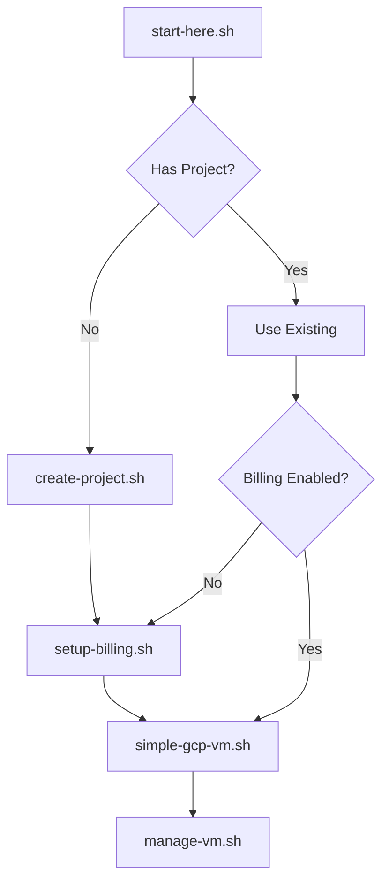
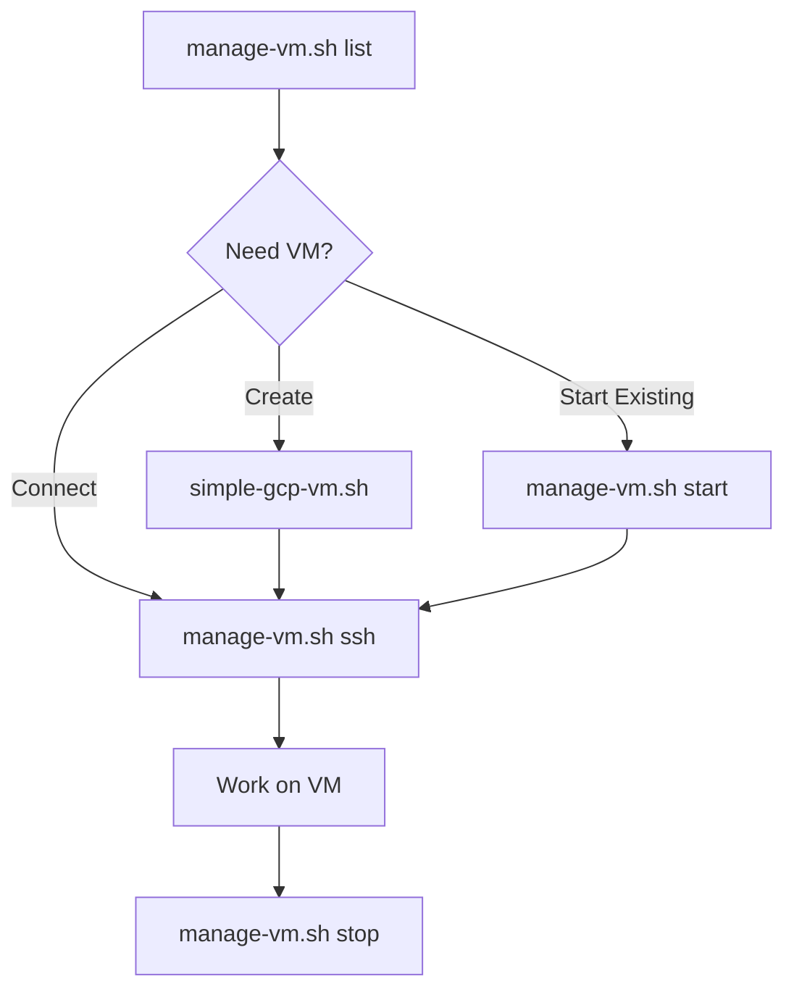

# Scripts Reference Guide

Complete documentation of all Claude Code VM scripts - what they do, when to use them, and how they work together.

## 🎯 **Quick Reference**

| Script | Purpose | When to Use |
|--------|---------|-------------|
| `start-here.sh` | **Interactive setup wizard** | First time setup or when unsure what to do |
| `create-project.sh` | **Create new GCP project** | Need dedicated project for Claude Code |
| `setup-billing.sh` | **Enable billing on project** | After project creation, before VM creation |
| `simple-gcp-vm.sh` | **Create single VM** | Create one VM quickly |
| `manage-vm.sh` | **Manage existing VMs** | Daily VM operations (start/stop/ssh/delete) |

---

## 📋 **Detailed Script Documentation**

### **1. `start-here.sh` - Interactive Setup Wizard**

**Purpose**: Complete guided setup experience for new users

**What it does**:
- ✅ Checks Google Cloud CLI installation
- ✅ Verifies authentication
- ✅ Offers to create new project OR use existing
- ✅ Validates billing and API enablement
- ✅ Interactive menu for first actions
- ✅ Guides through machine type selection

**When to use**:
- First time setting up Claude Code VMs
- When you're unsure what to do next
- Want a guided experience instead of individual commands

**Example**:
```bash
./start-here.sh
# Follows interactive prompts
```

**Dependencies**: 
- Google Cloud CLI installed
- User authenticated with `gcloud auth login`

---

### **2. `create-project.sh` - New Project Creator**

**Purpose**: Create dedicated GCP project for Claude Code development

**What it does**:
- 🏗️ Creates new GCP project with unique ID
- 🔧 Enables Cloud Billing API
- 💳 Links billing account (interactive)
- 🌍 Sets default region/zone
- 💾 Saves configuration to `.claude-gcp-project`
- 🚀 Offers to create first VM immediately

**When to use**:
- Want dedicated project for Claude Code
- Need clean separation from other GCP resources
- Starting fresh Claude Code development

**Example**:
```bash
./create-project.sh
# Interactive prompts for project name and ID
# Auto-generates unique ID like: claude-code-dev-20250615-1851
```

**Output**:
- New GCP project
- `.claude-gcp-project` config file for other scripts

**Dependencies**:
- Google Cloud CLI
- Valid billing account

---

### **3. `setup-billing.sh` - Billing Enablement**

**Purpose**: Enable billing and Compute Engine API for existing project

**What it does**:
- 💳 Lists available billing accounts
- 🔗 Links billing to project
- 🔧 Enables Compute Engine API (requires billing)
- 🛡️ Creates SSH firewall rule
- ✅ Confirms project ready for VM creation

**When to use**:
- After creating project but billing setup failed
- Project exists but can't create VMs (billing not enabled)
- Need to switch billing accounts for project

**Example**:
```bash
./setup-billing.sh                    # Use current default project
./setup-billing.sh my-project-id      # Specify project
```

**Dependencies**:
- Existing GCP project
- At least one billing account in your Google Cloud account

---

### **4. `simple-gcp-vm.sh` - VM Creation**

**Purpose**: Create single VM instance ready for Claude Code development

**What it does**:
- 🖥️ Creates VM with optimal specs for Claude Code
- 📦 Installs Node.js, Git, development tools
- 🔑 Generates SSH keys for GitHub
- 📁 Creates workspace directories
- 🎯 Displays connection instructions

**When to use**:
- Create one VM quickly
- Need VM with specific configuration
- Creating additional VMs in existing project

**Configuration via environment variables**:
```bash
# Customize VM creation
VM_NAME=my-dev-vm GCP_MACHINE_TYPE=e2-medium ./simple-gcp-vm.sh

# All available options:
export VM_NAME="custom-vm-name"
export GCP_MACHINE_TYPE="e2-standard-2"  
export GCP_ZONE="us-west1-a"
export GCP_PROJECT_ID="my-project"
```

**VM Specs (default)**:
- Machine: e2-standard-4 (4 vCPU, 16GB RAM)
- Disk: 50GB standard persistent disk
- OS: Ubuntu 22.04 LTS
- Cost: ~$0.13/hour

**Dependencies**:
- Project with billing enabled
- Compute Engine API enabled

---

### **5. `manage-vm.sh` - VM Operations**

**Purpose**: Daily management of existing VMs

**Available commands**:
```bash
./manage-vm.sh list                    # List all VMs with status
./manage-vm.sh create                  # Create new VM (calls simple-gcp-vm.sh)
./manage-vm.sh start vm-name           # Start stopped VM
./manage-vm.sh stop vm-name            # Stop running VM
./manage-vm.sh ssh vm-name             # Connect via SSH
./manage-vm.sh status vm-name          # Show detailed VM info
./manage-vm.sh ip vm-name              # Get VM IP address
./manage-vm.sh delete vm-name          # Delete VM permanently
```

**When to use**:
- Daily VM operations
- Check VM status and costs
- Start/stop VMs to save money
- Connect to existing VMs

**Example workflow**:
```bash
# Morning routine
./manage-vm.sh list                    # See what's running
./manage-vm.sh start my-dev-vm         # Start my main VM
./manage-vm.sh ssh my-dev-vm           # Connect and code

# Evening routine  
./manage-vm.sh stop my-dev-vm          # Stop to save money
```

**Dependencies**:
- Existing VMs in current project

---

## 🔄 **Script Relationships & Workflow**

### **Complete Setup Flow**:


### **Daily Usage Flow**:


---

## 📁 **Generated Files**

### **`.claude-gcp-project`**
**Created by**: `create-project.sh`
**Used by**: `simple-gcp-vm.sh`, other scripts

**Content**:
```bash
export GCP_PROJECT_ID="claude-code-dev-20250615-1851"
export GCP_REGION="us-central1"
export GCP_ZONE="us-central1-a"
export PROJECT_NAME="Claude Code Development"
```

**Purpose**: Persistent configuration that other scripts automatically load

---

## 🎛️ **Environment Variables**

### **Project Configuration**:
```bash
export GCP_PROJECT_ID="your-project-id"      # Override project
export GCP_REGION="us-west1"                 # Override region
export GCP_ZONE="us-west1-a"                 # Override zone
```

### **VM Configuration**:
```bash
export VM_NAME="my-custom-vm"                 # Custom VM name
export GCP_MACHINE_TYPE="e2-medium"          # Machine size
```

### **Script Behavior**:
```bash
export VM_TEST_VERBOSE=true                  # More detailed output
```

---

## 💡 **Usage Patterns**

### **Pattern 1: Complete New Setup**
```bash
./start-here.sh              # Interactive setup
# Follow prompts to create project and first VM
```

### **Pattern 2: Manual Step-by-Step**
```bash
./create-project.sh          # Create project
./setup-billing.sh           # Enable billing
./simple-gcp-vm.sh          # Create VM
./manage-vm.sh ssh vm-name   # Connect
```

### **Pattern 3: Existing Project**
```bash
gcloud config set project existing-project-id
./simple-gcp-vm.sh          # Create VM
./manage-vm.sh list         # Manage VMs
```

### **Pattern 4: Multiple VMs**
```bash
# Create several VMs
for i in {1..3}; do VM_NAME=dev-vm-$i ./simple-gcp-vm.sh; done

# Manage them
./manage-vm.sh list
./manage-vm.sh start dev-vm-1
./manage-vm.sh ssh dev-vm-1
```

### **Pattern 5: Cost Management**
```bash
# Stop all VMs at night
./manage-vm.sh list | grep RUNNING | while read vm; do
  ./manage-vm.sh stop $vm
done

# Start specific VM in morning
./manage-vm.sh start my-main-vm
```

---

## 🚨 **Error Scenarios & Solutions**

### **"gcloud: command not found"**
**Script**: Any script
**Solution**: Install Google Cloud CLI first
```bash
curl https://sdk.cloud.google.com | bash
exec -l $SHELL
```

### **"INVALID_ARGUMENT: project display name contains invalid characters"**
**Script**: `create-project.sh`
**Cause**: Project name has invalid characters (like `_`)
**Solution**: Script now auto-sanitizes names

### **"Billing account not found"**
**Script**: `create-project.sh`, `simple-gcp-vm.sh`
**Solution**: Run `./setup-billing.sh` or enable billing in console

### **"VM not found"**
**Script**: `manage-vm.sh`
**Solution**: Check VM name with `./manage-vm.sh list`

### **"Permission denied"**
**Script**: Any script
**Solution**: Ensure you have proper GCP permissions and are authenticated

---

## 🔍 **Troubleshooting Commands**

```bash
# Check current configuration
gcloud config list

# Check project billing status
gcloud beta billing projects describe $(gcloud config get-value project)

# Check enabled APIs
gcloud services list --enabled

# Check VM status
gcloud compute instances list

# Check quotas
gcloud compute project-info describe --format="table(quotas.metric,quotas.limit,quotas.usage)"
```

---

**💡 Tip**: Start with `./start-here.sh` for the complete guided experience, then use individual scripts for specific tasks!