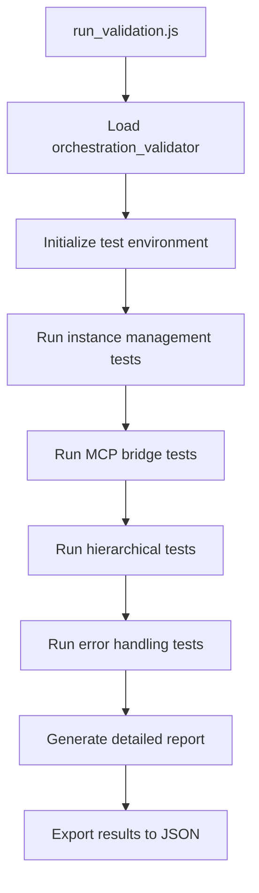

# Workflow Orchestration Testing - Senior Engineer Protocol

**Project-local testing for automatic workflow orchestration validation**

## Quick Start

```bash
# Run complete validation
cd /home/ubuntu/dev_ops/tools/tmux-claude-mcp-server/workflows
node testing/run_validation.js

# Or use npm scripts
npm test
npm run validate
```

## Project Structure

```
/home/ubuntu/dev_ops/tools/tmux-claude-mcp-server/workflows/
├── claude.md                              # Senior Engineer constraints & protocol
├── package.json                           # Dependencies
├── testing/
│   ├── run_validation.js                  # Main test runner
│   ├── real_orchestration_validator.js    # Core validator
│   └── orchestration_validation_*.json    # Test reports
└── README.md                              # This file
```

## Senior Engineer Validation Protocol

The validation system operates under specific constraints:

### 1. Project-Local Operation
- **No external code generation or file modification**
- All tests run against existing codebase only
- Only validates existing functionality

### 2. Real-World Testing
- Uses actual MCP bridge and orchestration systems
- No mocks or simulations for core functionality  
- Tests real Claude instance spawning and communication

### 3. Validation Coverage
- **Instance Management**: Spawn, list, terminate operations
- **MCP Communication**: Bridge reliability and message passing
- **Hierarchical Orchestration**: Executive → Manager → Specialist flows
- **Error Handling**: Recovery and graceful degradation
- **Performance**: Resource usage and response times

## Test Execution Flow



## Test Categories

### Core Infrastructure Tests
- Instance spawning with proper tmux sessions
- MCP bridge connectivity and message routing
- State management and persistence

### Orchestration Pattern Tests  
- Executive-Manager-Specialist hierarchy
- Task delegation and result aggregation
- Cross-instance communication

### Resilience Tests
- Network partition simulation
- Instance failure recovery
- Resource exhaustion handling

## Usage Examples

### Run Full Validation Suite
```bash
node testing/run_validation.js --full
```

### Run Specific Test Category
```bash
node testing/run_validation.js --category=orchestration
```

### Generate Detailed Report
```bash
node testing/run_validation.js --report --output=validation_$(date +%Y%m%d).json
```

## Report Format

Test results are exported in structured JSON:

```json
{
  "timestamp": "2024-XX-XX",
  "environment": "production",
  "testResults": {
    "instanceManagement": { "passed": true, "details": {...} },
    "mcpBridge": { "passed": true, "details": {...} },
    "orchestration": { "passed": false, "error": "..." }
  },
  "performance": {
    "avgResponseTime": "120ms",
    "memoryUsage": "45MB",
    "instanceCount": 15
  },
  "recommendations": ["..."]
}
```

## Integration with Main System

This testing framework validates the core orchestration system documented in the main project. For comprehensive workflow documentation, see the sections below.

---

# Scalable Workflow System

A modular, extensible workflow system for orchestrating Claude instances with prompt-based automation.

## 📁 Directory Structure

```
workflows/
├── README.md                    # This file - system overview and usage guide
├── CLAUDE.md                    # Project instructions and guidelines
├── task                         # Main task execution script
├── quick_task.js                # Quick task runner
├── unified_workflow_launcher.sh # Main unified workflow launcher
├── config/                      # Configuration files
│   ├── workflow_config.json             # Main workflow configuration
│   ├── example_chain_config.json        # Example chain configuration
│   ├── phase_implementation_workflow.json # Phase workflow config
│   ├── simple_task_progression.json     # Simple task configuration
│   └── task_progression_config.json     # Task progression settings
├── docs/                        # System documentation
│   ├── CHAIN_MONITOR_GUIDE.md           # Chain monitoring guide
│   ├── CHANGELOG.md                     # Project changelog
│   ├── CURRENT_STATUS.md                # Current system status
│   ├── GLOBAL_INSTALL_GUIDE.md          # Installation guide
│   ├── PHASE_IMPLEMENTATION_GUIDE.md    # Phase implementation guide
│   ├── SCALABLE_STRUCTURE_SUMMARY.md    # Architecture overview
│   ├── SYSTEM_SUMMARY.md                # System summary
│   ├── TASK_PROGRESSION_GUIDE.md        # Task progression guide
│   ├── TEST_README.md                   # Testing documentation
│   ├── demo_workflow_test.md            # Workflow demo and examples
│   ├── prompt_chain.md                  # Execute-Compare-Commit prompt chain
│   ├── workflow_advanced_actions.md     # Advanced action documentation
│   ├── workflow_system_design.md        # System design specification
│   ├── workflow_system_fix_plan.txt     # Implementation plan
│   └── workflow_system_summary.md       # System summary
├── examples/                    # Example workflows for learning
│   ├── example_simple.yaml                  # Basic prompt chaining
│   ├── example_code_analysis.yaml           # Complex analysis workflow
│   ├── example_parallel_review.yaml         # Multi-instance parallel work
│   ├── example_test_generation.yaml         # Iterative test generation
│   ├── execute_compare_commit.yaml          # Execute-Compare-Commit workflow
│   ├── execute_compare_commit_simple.yaml   # Simplified version
│   ├── execute_compare_commit_workflow.yaml # Full-featured version
│   ├── phase_workflow.yaml                  # Phase implementation workflow
│   └── [additional example workflows]       # Various workflow examples
├── library/                     # Reusable workflow components
│   ├── common/                  # Common workflow patterns
│   │   └── code_analysis.yaml          # Reusable code analysis pattern
│   └── templates/               # Workflow templates for scaffolding
│       ├── basic.yaml                  # Simple workflow template
│       ├── conditional_branching.yaml  # Conditional logic template
│       ├── parallel_processing.yaml    # Parallel workflow template
│       └── script_integration.yaml     # Script integration template
├── logs/                        # Log files
│   └── workflow.log             # Workflow execution logs
├── scripts/                     # Supporting scripts and utilities
│   ├── chain_keyword_monitor.js        # Keyword monitoring for workflows
│   ├── chain_prompts.js                # Prompt chaining utility
│   ├── clean_secrets.sh                # Secret cleaning utility
│   ├── continue_phase.sh               # Phase continuation script
│   ├── create_workflow.cjs             # Workflow scaffolding tool
│   ├── install_global.sh               # Global installation script
│   ├── phase_launcher.sh               # Phase launcher script
│   ├── phase_quick.js                  # Quick phase execution
│   ├── remove_secrets_properly.sh      # Secure secret removal
│   ├── run_workflow.sh                 # Shell script wrapper
│   ├── task_chain_launcher.js          # Task chain launcher
│   └── workflow_runner.js              # Workflow execution engine
├── shared/                      # Shared utilities
│   └── workflow_utils.js        # Common workflow utilities
├── src/                         # Source templates and components
│   └── role_templates/          # Role-specific templates
│       └── specialist.md        # Specialist role template
├── tests/                       # Test workflows and test runner
│   ├── run_tests.sh                     # Test runner script
│   ├── final_comprehensive_test.js      # Comprehensive system test
│   ├── server_readiness_report.js       # Server readiness validation
│   ├── validate_server_setup.js        # Server setup validation
│   ├── test_basic.yaml                  # Basic functionality test
│   ├── test_complex_workflow.yaml       # Complex workflow test
│   ├── test_comprehensive.sh            # Comprehensive test script
│   ├── test_engine_only.yaml            # Engine-only test
│   ├── test_execute_compare_commit.yaml # Execute-Compare-Commit test
│   ├── test_file_ops.yaml               # File operations test
│   ├── test_log_only.yaml               # Logging test
│   ├── test_minimal.yaml                # Minimal functionality test
│   ├── test_script.yaml                 # Script execution test
│   └── test_script_actions.yaml         # Script actions test
├── user/                        # User-created workflows (initially empty)
└── workflow_state/              # Runtime workflow state
    └── [runtime state files]    # Workflow execution state
```

## 🚀 Quick Start

### 1. Install Dependencies
```bash
npm install
```

### 2. Run a Simple Workflow
```bash
# Use the workflow runner
node ../src/workflow/run_workflow.cjs examples/example_simple.yaml

# Or use npm scripts
npm run workflow:simple
```

### 3. Create Your First Workflow
```bash
# Interactive workflow creator
npm run workflow:create

# Or manually create a YAML file in examples/
```

## 🔧 System Components

### Action Executor
**File:** `../src/workflow/action_executor.cjs`

The Action Executor is responsible for:
- Loading modular action libraries
- Executing workflow actions with proper error handling
- Managing action dependencies and sequencing
- Providing action documentation and validation

### Keyword Monitor
**File:** `../src/workflow/keyword_monitor.cjs`

The Keyword Monitor enables:
- Automatic workflow progression based on output keywords
- Configurable polling intervals and timeouts
- Support for both simple and task-ID based keyword detection
- Robust error handling and recovery

### Workflow Engine
**File:** `../src/workflow/workflow_engine.cjs`

The Workflow Engine coordinates:
- YAML workflow parsing and validation
- Stage execution and transition management
- Context propagation between stages
- Error handling and recovery mechanisms

## 📝 Workflow YAML Format

### Basic Structure
```yaml
name: "Example Workflow"
description: "Demonstrates basic workflow capabilities"
context:
  project_type: "javascript"
  main_goal: "Analyze and improve code quality"

stages:
  - name: "analysis"
    actions:
      - action: "spawn"
        role: "specialist"
        context: "You are a code analysis specialist..."
    transitions:
      - trigger: "***ANALYSIS_COMPLETE***"
        next_stage: "recommendations"
        
  - name: "recommendations"
    actions:
      - action: "send"
        text: "Based on your analysis, provide specific recommendations..."
    transitions:
      - trigger: "***RECOMMENDATIONS_READY***"
        next_stage: "complete"
```

### Advanced Features

#### Conditional Transitions
```yaml
transitions:
  - trigger: "***SUCCESS***"
    next_stage: "deploy"
  - trigger: "***FAILURE***"
    next_stage: "debug"
  - trigger: "***TIMEOUT***"
    next_stage: "retry"
```

#### Dynamic Context
```yaml
actions:
  - action: "set_context"
    context_updates:
      analysis_results: "{{previous_stage_output}}"
      timestamp: "{{current_time}}"
```

#### Parallel Execution
```yaml
actions:
  - action: "spawn"
    role: "specialist"
    instance_id: "analyzer_1"
    parallel: true
  - action: "spawn"
    role: "specialist"
    instance_id: "analyzer_2"
    parallel: true
```

## 🎯 Action Types

### Core Actions
- **spawn**: Create new Claude instances
- **send**: Send prompts to instances
- **read**: Read output from instances
- **list**: List active instances
- **terminate**: Stop instances
- **wait**: Pause execution

### Git Actions
- **git_commit**: Commit changes
- **git_push**: Push to repository
- **git_branch**: Create/switch branches
- **git_merge**: Merge branches

### Analysis Actions
- **code_review**: Automated code review
- **test_generation**: Generate unit tests
- **documentation**: Generate documentation
- **quality_check**: Code quality analysis

### Utility Actions
- **log**: Log messages
- **set_context**: Update workflow context
- **return_to_blank_state**: Reset Claude instance

## 🔄 Execute-Compare-Commit Pattern

A powerful three-stage pattern for iterative development:

### 1. Execute Stage
```yaml
- name: "execute"
  actions:
    - action: "spawn"
      role: "specialist"
      context: |
        Implement the requested feature following these requirements:
        {{requirements}}
        
        When complete, say "***EXECUTE_FINISHED***"
  transitions:
    - trigger: "***EXECUTE_FINISHED***"
      next_stage: "compare"
```

### 2. Compare Stage
```yaml
- name: "compare"
  actions:
    - action: "send"
      text: |
        Review your implementation against the original requirements.
        Identify gaps, issues, or improvements needed.
        
        When analysis complete, say "***COMPARE_FINISHED***"
  transitions:
    - trigger: "***COMPARE_FINISHED***"
      next_stage: "commit"
```

### 3. Commit Stage
```yaml
- name: "commit"
  actions:
    - action: "send"
      text: |
        Finalize your implementation, add documentation,
        and prepare for deployment.
        
        When ready, say "***COMMIT_FINISHED***"
  transitions:
    - trigger: "***COMMIT_FINISHED***"
      next_stage: "complete"
```

## 🧪 Testing Workflows

### Run All Tests
```bash
npm run workflow:test
```

### Run Specific Tests
```bash
# Test minimal functionality
npm run workflow:test:minimal

# Test script execution
npm run workflow:test:script

# Test file operations
npm run workflow:test:files
```

### Create Custom Tests
```yaml
# tests/test_custom.yaml
name: "Custom Test"
description: "Test specific functionality"

stages:
  - name: "test_stage"
    actions:
      - action: "spawn"
        role: "specialist"
        context: "Test implementation here..."
    transitions:
      - trigger: "***TEST_COMPLETE***"
        next_stage: "complete"
```

## 📊 Performance Optimization

### Workflow Monitoring
```bash
# Monitor workflow execution
npm run monitor

# Generate performance reports
npm run optimize
```

### Best Practices
1. **Use specific keywords** for reliable transitions
2. **Keep stages focused** on single objectives
3. **Implement proper error handling** with timeout stages
4. **Test workflows incrementally** during development
5. **Monitor resource usage** during execution

## 🔧 Configuration

### Workflow Configuration
**File:** `config/workflow_config.json`
```json
{
  "default_timeout": 300,
  "default_poll_interval": 5,
  "max_instances": 10,
  "logging_level": "info",
  "action_modules": [
    "core",
    "git", 
    "analysis",
    "testing"
  ]
}
```

### Action Module Configuration
```json
{
  "actions": {
    "spawn": {
      "timeout": 30,
      "retry_count": 3
    },
    "git_commit": {
      "auto_stage": true,
      "sign_commits": false
    }
  }
}
```

## 🚨 Troubleshooting

### Common Issues

#### Workflow Hangs at Stage
**Cause:** Keyword not detected
**Solution:** Check instance output and keyword spelling

```bash
# Debug instance output
node ../scripts/mcp_bridge.js read '{"instanceId": "spec_1_1_123456", "lines": 50}'
```

#### Instance Creation Fails
**Cause:** tmux session conflicts or resource limits
**Solution:** Clean up stale sessions

```bash
# List tmux sessions
tmux ls

# Kill stale Claude sessions
tmux kill-session -t claude_*
```

#### High Memory Usage
**Cause:** Too many concurrent instances
**Solution:** Adjust workflow configuration

```json
{
  "max_instances": 5,
  "cleanup_interval": 60
}
```

### Debug Mode
```bash
# Enable debug logging
DEBUG=1 npm run workflow:simple

# Verbose output
VERBOSE=1 node ../src/workflow/run_workflow.cjs examples/debug.yaml
```

## 🔮 Advanced Topics

### Custom Action Development
Create new action modules in `library/actions/`:

```javascript
// library/actions/custom.js
class CustomActions {
  async executeCustomAction(action, context) {
    // Implementation here
    return { success: true, result: "..." };
  }
  
  getActionDocumentation() {
    return {
      custom_action: {
        description: "Performs custom operation",
        parameters: {
          input: "string"
        }
      }
    };
  }
}

module.exports = CustomActions;
```

### Workflow Templates
Create reusable templates in `library/prompts/`:

```yaml
# Template usage
actions:
  - action: "send"
    template: "code_review"
    template_vars:
      file_path: "{{target_file}}"
      review_type: "security"
```

### Integration with External Systems
```yaml
actions:
  - action: "webhook"
    url: "https://api.example.com/notify"
    method: "POST"
    data:
      workflow: "{{workflow_name}}"
      stage: "{{current_stage}}"
      status: "{{stage_status}}"
```

## 📚 Learning Resources

### Example Workflows
1. **example_simple.yaml** - Basic prompt chaining
2. **example_code_analysis.yaml** - Complex analysis workflow
3. **example_parallel_review.yaml** - Multi-instance coordination
4. **execute_compare_commit.yaml** - Iterative development pattern

### Documentation
- **workflow_system_design.md** - Architecture deep dive
- **workflow_advanced_actions.md** - Advanced action reference
- **demo_workflow_test.md** - Interactive examples

### Community
- Share workflows in `examples/community/`
- Report issues via GitHub
- Contribute new actions and templates

## 🎉 Getting Started Checklist

- [ ] Install dependencies (`npm install`)
- [ ] Run basic test (`npm run workflow:test:minimal`)
- [ ] Try simple workflow (`npm run workflow:simple`)
- [ ] Create custom workflow (`npm run workflow:create`)
- [ ] Read system design docs (`docs/workflow_system_design.md`)
- [ ] Experiment with Execute-Compare-Commit pattern
- [ ] Build your first production workflow

---

**Ready to orchestrate? Start with `npm run workflow:simple` and explore the examples!**